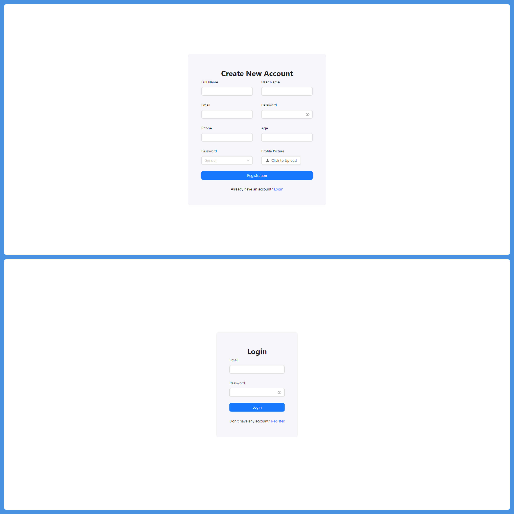
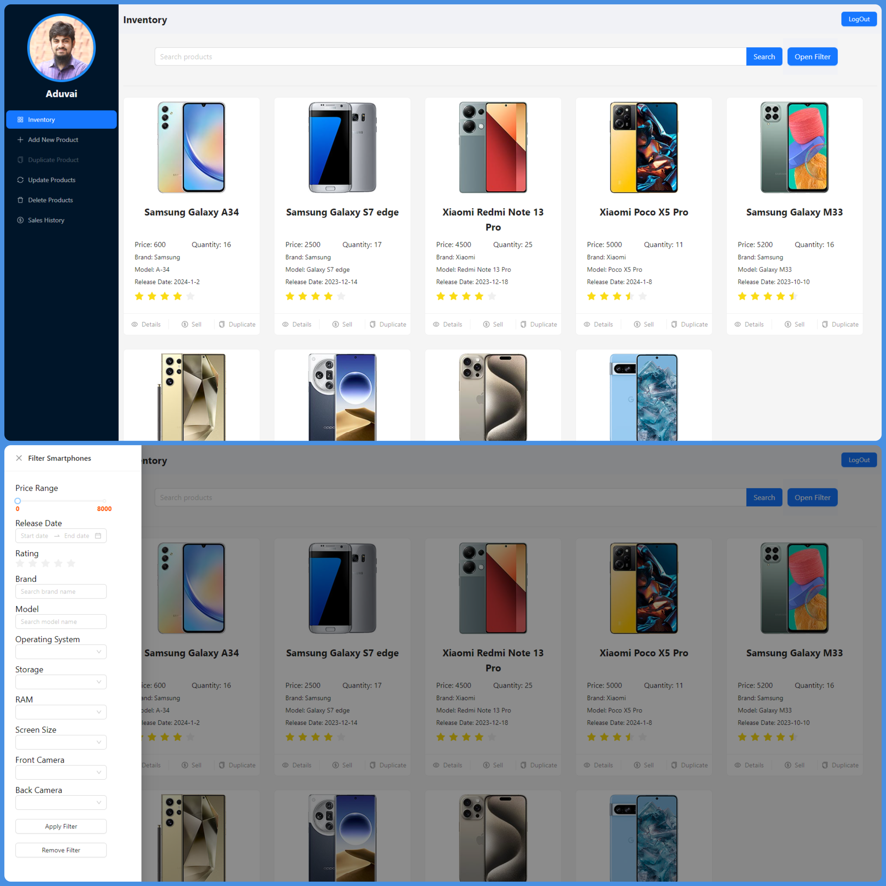
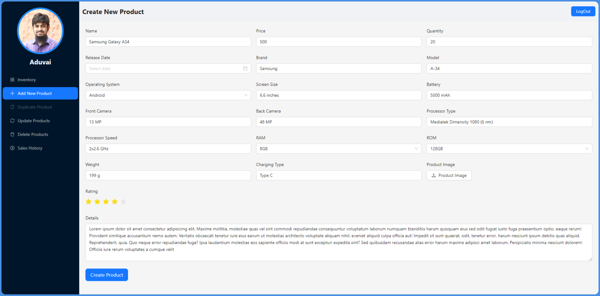
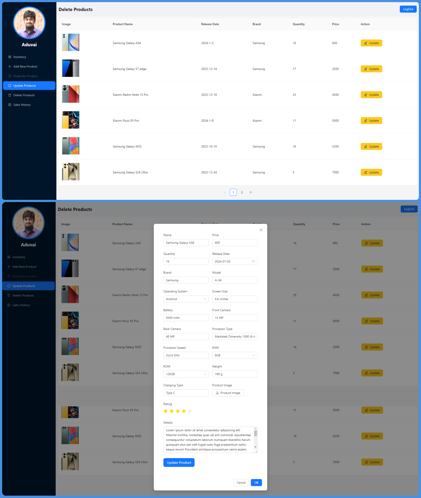
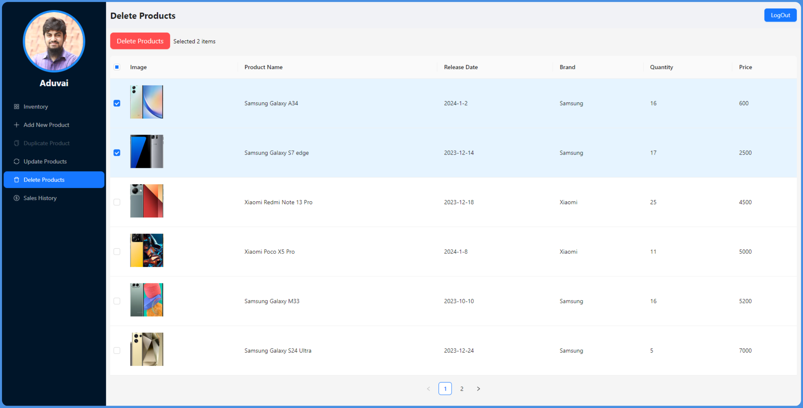
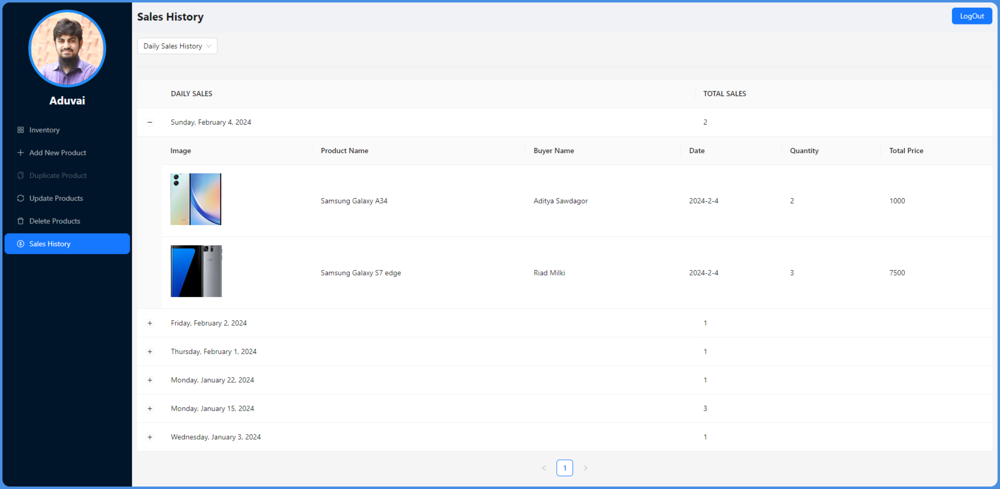
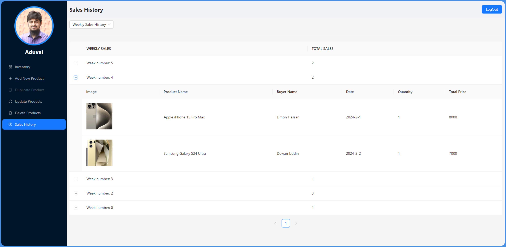
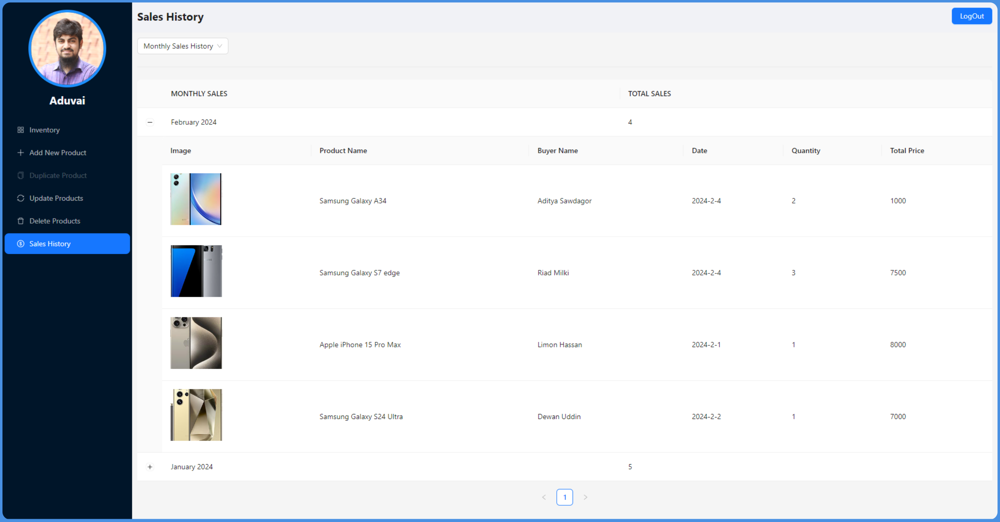
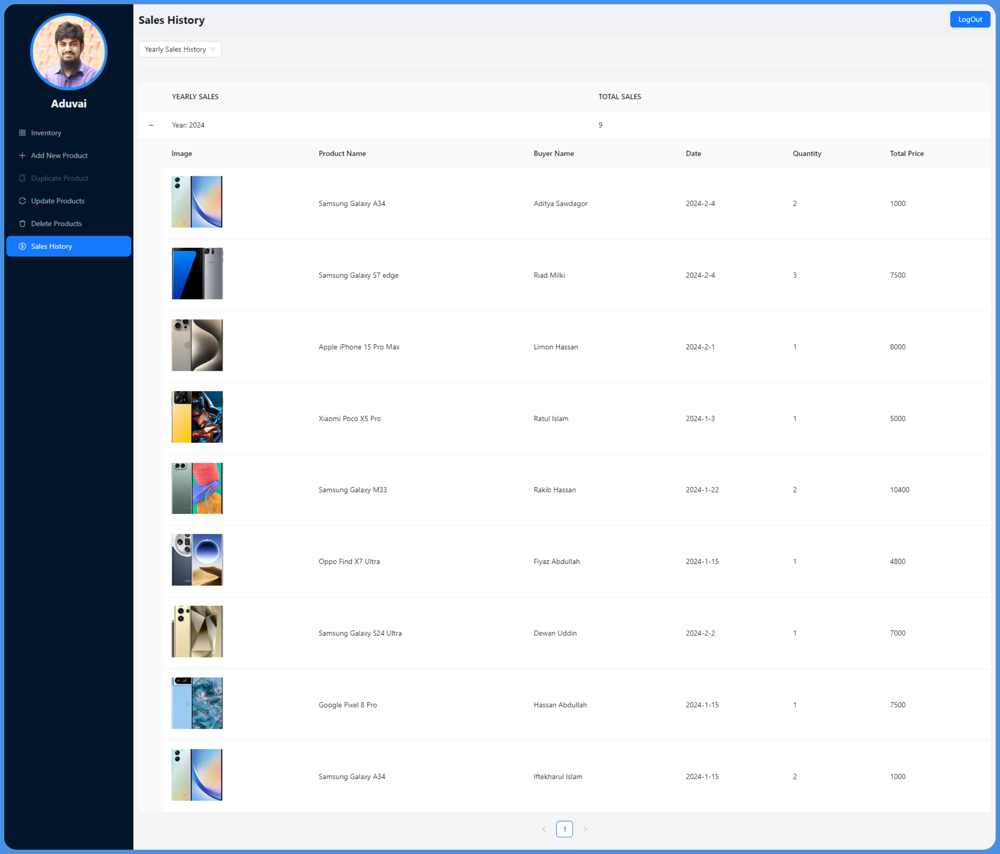

# Smartphone Management Dashboard Client

[]() []() []()

This is `Smartphone Management System` for a warehouse. The main purpose of the application is to maintain `C-CREATE R-READ U-UPDATE D-DELETE` for products. User can sell a product, and track sales history based on `daily`, `weekly`, `monthly` and `yearly`. Implement `authentication` and `authorization` using jwt token. The application is authorized using role based routing. There are 3 types of user roles such as `Super admin`, `Branch manager`, and `Seller`. The entire application's state managed by `redux-toolkit` and data fetching with caching using `redux-toolkit-query`.

Server Github:

```bash
https://github.com/Porgramming-Hero-web-course/l2b2-full-stack-a5-server-side-Adnan-Sarkar
```

Youtube video

```bash
https://youtu.be/vbY0cyaSNu4?si=dvzBIbOoga2vEKSD
```

or

[Click to see in youtube](https://youtu.be/vbY0cyaSNu4?si=dvzBIbOoga2vEKSD)

## Table of Contents

- [Key Features](#key-features)
- [Technology Used](#technology-used)
- [Live Link](#live-link)
- [Getting Started](#getting-started)
  - [Prerequisites](#prerequisites)
  - [Installation locally](#installation-locally)
  - [Running the Application](#running-the-application)
- [Application Overview](#application-overview)

## Key Features

Role Based Routing:

1. **Super Admin**

   - Inventory page
   - Create product page
   - Duplicate product page
   - Update product page
   - Delete product page
   - Sales history page
   - Create user page
   - User list page

2. **Branch Manager**

   - Inventory page
   - Create product page
   - Duplicate product page
   - Update product page

3. **Seller**

   - Inventory page

Functionality:

1. **Products:**

   - Create new products.
   - Sell products with a minimum quantity of 1.
   - Generate and provide a downloadable PDF invoice automatically upon the successful sale of a product.
   - Update existing product details.
   - Delete single/multiple products at a time.
   - Duplicate any product and edit to create a new product.

2. **Sales:**
   - View daily sales history.
   - View weekly sales history.
   - View monthly sales history.
   - View yearly sales history.

## Technology Used

- **React Router**
- **Redux Toolkit**
- **Redux Persist**
- **Ant Design**
- **React Hot Toast**
- **React Hook Form**
- **Day.js**
- **JWT Decode**
- **jspdf**
- **Dev Tools**
  - **TypeScript**
  - **ESLint**

### Live Link

```bash
https://course-review-with-auth-by-adnan-sarkar.vercel.app/
```

## Getting Started

These instructions will help you set up and run the application on your local machine.

### Prerequisites

- Node.js and npm installed on your machine.

### Installation locally

1. Clone the repository:

```bash
https://github.com/Porgramming-Hero-web-course/l2b2-full-stack-a5-client-side-Adnan-Sarkar.git
```

2. Navigate to the project directory:

```bash
cd smartphone-management-dashboard-client
```

3. Install dependencies:

```bash
npm install
```

### Running the Application

```bash
npm run dev
```

## Application Overview

1. Login and Registration page.
   

2. Inventory page.
   

3. Create new product page.
   

4. Duplicate and create new product page.
   .png>)

5. Update products page.
   

6. Delete products page.
   

7. Daily sales history.
   

8. Weekly sales history.
   

9. Monthly sales history.
   

10. Yearly sales history.
    

<br><br>

Thank you for exploring the `Smartphone Management Dashboard Client` application! Feel free to provide feedback, report issues.

## 📢 Social Links

- [](https://www.linkedin.com/in/adnan-sarkar-8b54341a0/)
- [](https://twitter.com/AdnanSarkar14)
- [](https://www.facebook.com/adnansarkaraduvai/)
- [](https://www.instagram.com/_a_d_u_v_a_i_/)
- [](https://adnansarkar.hashnode.dev/)
